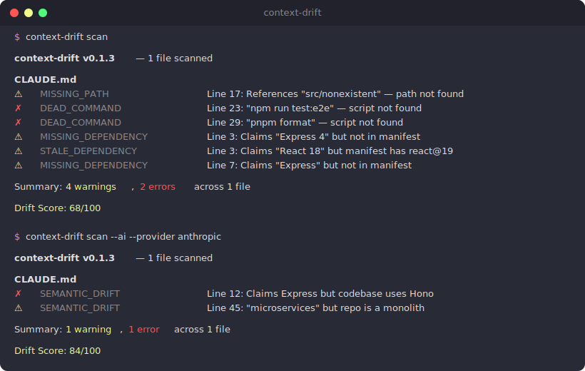

# context-drift

[](https://github.com/geekiyer/context-drift/actions/workflows/ci.yml)
[](https://www.npmjs.com/package/@geekiyer/context-drift)

A CLI that checks whether your AI context files (`CLAUDE.md`, `AGENTS.md`, `.cursorrules`, etc.) still match reality.

## Why this exists

You write a `CLAUDE.md` once, maybe twice. Then the codebase moves on. Dependencies get swapped, folders get renamed, scripts get deleted. Nobody updates the context file because nobody remembers it's there. Now your AI agent is confidently following stale instructions, and you're debugging the wrong thing for an hour before you realize the file lied.

context-drift reads your context files, pulls out the concrete claims (paths, commands, dependency names, versions), and checks them against the repo. If something doesn't line up, it tells you.

<p align="center">
  
</p>

## Install

```bash
npm install -g @geekiyer/context-drift
```

Or just run it directly:

```bash
npx @geekiyer/context-drift scan
```

## Usage

```bash
# Scan the current repo
context-drift scan

# JSON output for CI
context-drift scan --format json

# Treat warnings as errors
context-drift scan --strict

# Enable AI-powered semantic checks (see below)
context-drift scan --ai

# Generate a config file
context-drift init
```

## Example output

```
context-drift v0.1.3 -- 3 files scanned

CLAUDE.md (last modified: 84 days ago, 217 commits since)
  ⚠  STALE_DEPENDENCY       Line 12: Claims "Express 4" but "express" not found in any manifest
  ⚠  MISSING_PATH           Line 28: References "src/services/" -- path not found
  ✗  DEAD_COMMAND            Line 45: "npm run test:e2e" -- script "test:e2e" not found in package.json

AGENTS.md
  ⚠  CROSS_FILE_CONFLICT    Line 8: Line 8 vs CLAUDE.md:45 -- different test commands

.cursorrules
  ✓  No issues detected

Summary: 3 warnings, 1 error across 3 files

Drift Score: 81/100
```

## What it checks

### Deterministic checks (no API key needed)

**Staleness** -- How old is the file? How many commits have landed since it was last touched?

| Threshold | Warning | Error |
|-----------|---------|-------|
| Days      | 30      | 90    |
| Commits   | 50      | 200   |

**Dependencies** -- Pulls dependency claims out of context files ("uses React 18", "Express backend") and checks them against your manifest (`package.json`, `requirements.txt`, `pyproject.toml`, `go.mod`, `Cargo.toml`). Reports missing packages and major version mismatches.

**Paths** -- Finds path references like `` `src/components/` `` or `` `lib/utils.ts` `` and checks whether they exist.

**Commands** -- Finds CLI commands like `` `npm run test:e2e` `` or `` `make build` `` and verifies the scripts/targets actually exist.

**Cross-file conflicts** -- When you have multiple context files, context-drift compares them against each other. If `CLAUDE.md` says the test command is `npm test` and `AGENTS.md` says it's `yarn test`, that's a conflict.

### AI semantic checks (`--ai`)

Pass `--ai` to enable an LLM-powered pass that catches things deterministic checks can't: prose descriptions that no longer match the code, outdated architectural claims, stale convention descriptions.

```bash
# Auto-detects provider from env vars, falls back to Ollama
context-drift scan --ai

# Specify provider and model
context-drift scan --ai --provider anthropic --model claude-haiku-4-5-20251001
context-drift scan --ai --provider openai --model gpt-4o-mini
context-drift scan --ai --provider ollama --model qwen2:7b
```

Provider resolution order when `--provider` is not specified:
1. `ANTHROPIC_API_KEY` env var set -- uses Anthropic
2. `OPENAI_API_KEY` env var set -- uses OpenAI
3. Neither set -- falls back to Ollama (local, free, requires [Ollama](https://ollama.com) running)

The semantic checker reads the actual source files referenced in each section of your context file and sends them alongside the claims to the LLM. It only flags things it can prove are wrong from the code -- not things it can't verify.

### Drift score

Every scan produces a 0-100 drift score. Starts at 100, deducts points for issues and staleness:

- Each error: -10
- Each warning: -3
- File older than 30 days: -1
- File older than 90 days: -3

The score shows up in console output and is included in JSON output for tracking over time.

## Supported context files

Scanned automatically if they exist at the repo root:

- `CLAUDE.md`
- `AGENTS.md`
- `.cursorrules`
- `.github/copilot-instructions.md`
- `.windsurfrules`
- `GEMINI.md`

You can add more in the config.

## Configuration

Create `.context-drift.yml` in your repo root, or run `context-drift init`:

```yaml
# Extra context files to scan
files:
  - docs/AI_CONTEXT.md
  - .claude/project-notes.md

# Staleness thresholds
staleness:
  warn_days: 30
  warn_commits: 50
  error_days: 90
  error_commits: 200

# Suppress specific findings
ignore:
  - code: STALE_DEPENDENCY
    file: CLAUDE.md
    line: 12
  - code: MISSING_PATH
    pattern: "docs/legacy/*"

# Treat warnings as errors
strict: false
```

## CLI reference

```
context-drift scan [path]              Scan repo at path (default: cwd)
context-drift scan --format json       Machine-readable output
context-drift scan --format github     GitHub Actions annotations
context-drift scan --strict            Treat warnings as errors (exit 1)
context-drift scan --ai                Enable AI semantic checks
context-drift scan --ai --provider X   AI provider: anthropic, openai, ollama
context-drift scan --ai --model X      Model override (provider-specific)
context-drift init                     Generate a starter .context-drift.yml
context-drift version                  Print version
```

### Exit codes

| Code | Meaning |
|------|---------|
| `0`  | Clean (warnings are allowed unless `--strict`) |
| `1`  | Errors found |
| `2`  | Bad config or runtime failure |

## GitHub Action

```yaml
# .github/workflows/context-drift.yml
name: Context Drift Check
on: [pull_request]
jobs:
  check:
    runs-on: ubuntu-latest
    steps:
      - uses: actions/checkout@v4
        with:
          fetch-depth: 0  # full history needed
      - uses: context-drift/context-drift-action@v1
        with:
          strict: false
          config: .context-drift.yml  # optional
```

The action annotates the specific lines that have drifted, right on the PR.

## Programmatic API

```typescript
import { scan } from "@geekiyer/context-drift";

const result = await scan("/path/to/repo");

console.log(result.score);
// 97

console.log(result.summary);
// { errors: 1, warnings: 3 }

for (const file of result.results) {
  for (const issue of file.issues) {
    console.log(`${issue.file}:${issue.line} ${issue.code} ${issue.message}`);
  }
}
```

## Development

```bash
git clone https://github.com/geekiyer/context-drift.git
cd context-drift
pnpm install
pnpm build
pnpm test
```

### Project structure

```
src/
  cli.ts              CLI entry point (Commander)
  scanner.ts          Orchestrator: discover files, parse, check, report
  config.ts           .context-drift.yml loader
  parsers/
    context-file.ts   Markdown AST -> claims (deps, paths, commands)
    package-json.ts   package.json reader
    pyproject.ts       Python manifest reader
    go-mod.ts          go.mod reader
    cargo-toml.ts      Cargo.toml reader
  checkers/
    types.ts          Shared interfaces (Claim, CheckResult, Config, etc.)
    staleness.ts      Git history age check
    dependency.ts     Claimed deps vs manifest
    path.ts           Claimed paths vs filesystem
    command.ts        Claimed commands vs scripts/Makefile
    cross-file.ts     Multi-file consistency
    semantic.ts       AI-powered accuracy check
  ai/
    provider.ts       HTTP clients for Anthropic, OpenAI, Ollama
  reporters/
    console.ts        Colored terminal output
    json.ts           JSON for CI
    github-annotations.ts  GitHub Actions annotations
tests/
  fixtures/           Sample repos with intentionally drifted context files
```

### Running locally

```bash
# Build and run against any repo
pnpm build
node dist/cli.js scan /path/to/your/repo

# Run with AI checks using local Ollama
node dist/cli.js scan /path/to/your/repo --ai --provider ollama --model qwen2:7b

# Watch mode for development
pnpm dev
```

### Tech stack

- TypeScript (ESM), built with tsup
- Commander for CLI
- unified/remark for markdown parsing
- simple-git for git operations
- Vitest for tests
- Biome for linting

## License

MIT
