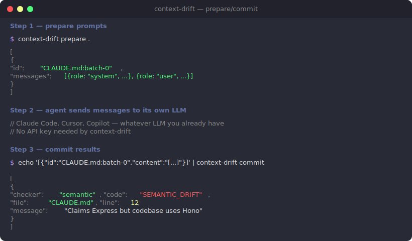

# context-drift

[](https://github.com/geekiyer/context-drift/actions/workflows/ci.yml)
[](https://www.npmjs.com/package/@geekiyer/context-drift)

A CLI that checks whether your AI context files (`CLAUDE.md`, `AGENTS.md`, `.cursorrules`, etc.) still match reality.

You write a `CLAUDE.md` once, maybe twice. Then the codebase moves on. Dependencies get swapped, folders get renamed, scripts get deleted. Nobody updates the context file because nobody remembers it's there. Now your AI agent is confidently following stale instructions, and you're debugging the wrong thing for an hour before you realize the file lied.

context-drift reads your context files, pulls out the concrete claims (paths, commands, dependency names, versions), and checks them against the repo. If something doesn't line up, it tells you.

## Install

```bash
npm install -g @geekiyer/context-drift
```

Or just run it directly:

```bash
npx @geekiyer/context-drift scan
```

## Bring your own LLM (prepare/commit)

Already running inside an AI agent? context-drift doesn't need its own API key. It builds the prompts, your agent calls its own LLM, and context-drift parses the results.

<p align="center">
  
</p>

### CLI workflow

```bash
# Step 1: context-drift gathers repo context and builds prompts
context-drift prepare . > requests.json

# Step 2: Your agent sends each request's messages to its LLM
# Each response: { "id": "CLAUDE.md:batch-0", "content": "<raw LLM text>" }

# Step 3: Feed the responses back
cat responses.json | context-drift commit
```

### MCP server (Claude Code, Cursor, etc.)

context-drift ships an MCP server so AI agents can call `prepare` and `commit` as tools natively -- no shell piping needed.

#### Setup

**Claude Code CLI** (recommended):

```bash
# If installed globally
claude mcp add context-drift context-drift-mcp

# Or without a global install
claude mcp add context-drift -- npx -y -p @geekiyer/context-drift context-drift-mcp
```

**Manual config** (`~/.claude/settings.json` or project `.claude/settings.json`):

```json
{
  "mcpServers": {
    "context-drift": {
      "command": "context-drift-mcp"
    }
  }
}
```

Verify it's connected:

```bash
claude mcp list
```

#### Available tools

| Tool | Input | Output |
|------|-------|--------|
| `prepare` | `path` (optional, defaults to cwd) | Array of requests with ready-to-send LLM messages |
| `commit` | `responses` (array of `{id, content}`) | Array of structured drift results |

#### Example usage in Claude Code

Once the MCP server is connected, ask Claude Code:

```
Check if this repo's context files have drifted using context-drift
```

The agent will:
1. Call the `prepare` tool to get prompts for each section of your context files
2. Send each prompt's `messages` through its own LLM
3. Call the `commit` tool with the responses to get structured results
4. Report any drift it finds

### Programmatic API

```typescript
import { scanPrepare, commitSemanticChecks } from "@geekiyer/context-drift";

// Step 1: context-drift gathers context and builds prompts
const requests = scanPrepare("/path/to/repo");

// Step 2: Your agent makes the LLM calls
const responses = await Promise.all(
  requests.map(async (req) => ({
    id: req.id,
    content: await myAgent.chat(req.messages), // your LLM
  }))
);

// Step 3: context-drift parses the results
const issues = commitSemanticChecks(responses);
```

Each request in the array contains:
- `id` -- unique identifier (e.g. `"CLAUDE.md:batch-0"`)
- `file` -- which context file is being checked
- `messages` -- ready-to-send `[{role, content}]` array
- `metadata` -- line ranges and section headings for the batch

For advanced use cases, the lower-level `prepareSemanticChecks(context)` is also exported if you need to build the `CheckerContext` yourself.

---

## Standalone scanning

context-drift also works as a standalone scanner with deterministic checks and optional direct LLM integration.

<p align="center">
  
</p>

### Quick start

```bash
# Scan the current repo
context-drift scan

# JSON output for CI
context-drift scan --format json

# Treat warnings as errors
context-drift scan --strict

# Enable AI-powered semantic checks (needs API key)
context-drift scan --ai

# Generate a config file
context-drift init
```

### What it checks

#### Deterministic checks (no API key needed)

**Staleness** -- How old is the file? How many commits have landed since it was last touched?

| Threshold | Warning | Error |
|-----------|---------|-------|
| Days      | 30      | 90    |
| Commits   | 50      | 200   |

**Dependencies** -- Pulls dependency claims out of context files ("uses React 18", "Express backend") and checks them against your manifest (`package.json`, `requirements.txt`, `pyproject.toml`, `go.mod`, `Cargo.toml`). Reports missing packages and major version mismatches.

**Paths** -- Finds path references like `` `src/components/` `` or `` `lib/utils.ts` `` and checks whether they exist.

**Commands** -- Finds CLI commands like `` `npm run test:e2e` `` or `` `make build` `` and verifies the scripts/targets actually exist.

**Cross-file conflicts** -- When you have multiple context files, context-drift compares them against each other. If `CLAUDE.md` says the test command is `npm test` and `AGENTS.md` says it's `yarn test`, that's a conflict.

#### AI semantic checks (`--ai`)

Pass `--ai` to enable an LLM-powered pass that catches things deterministic checks can't: prose descriptions that no longer match the code, outdated architectural claims, stale convention descriptions.

```bash
# Auto-detects provider from env vars, falls back to Ollama
context-drift scan --ai

# Specify provider and model
context-drift scan --ai --provider anthropic --model claude-haiku-4-5-20251001
context-drift scan --ai --provider openai --model gpt-4o-mini
context-drift scan --ai --provider ollama --model qwen2:7b
```

Provider resolution order when `--provider` is not specified:
1. `ANTHROPIC_API_KEY` env var set -- uses Anthropic
2. `OPENAI_API_KEY` env var set -- uses OpenAI
3. Neither set -- falls back to Ollama (local, free, requires [Ollama](https://ollama.com) running)

The semantic checker reads the actual source files referenced in each section of your context file and sends them alongside the claims to the LLM. It only flags things it can prove are wrong from the code -- not things it can't verify.

### Drift score

Every scan produces a 0-100 drift score. Starts at 100, deducts points for issues and staleness:

- Each error: -10
- Each warning: -3
- File older than 30 days: -1
- File older than 90 days: -3

The score shows up in console output and is included in JSON output for tracking over time.

### Basic programmatic API

```typescript
import { scan } from "@geekiyer/context-drift";

const result = await scan("/path/to/repo");

console.log(result.score);        // 97
console.log(result.summary);      // { errors: 1, warnings: 3 }

for (const file of result.results) {
  for (const issue of file.issues) {
    console.log(`${issue.file}:${issue.line} ${issue.code} ${issue.message}`);
  }
}
```

---

## Supported context files

Scanned automatically if they exist at the repo root:

- `CLAUDE.md`
- `AGENTS.md`
- `.cursorrules`
- `.github/copilot-instructions.md`
- `.windsurfrules`
- `GEMINI.md`

You can add more in the config.

## Configuration

Create `.context-drift.yml` in your repo root, or run `context-drift init`:

```yaml
# Extra context files to scan
files:
  - docs/AI_CONTEXT.md
  - .claude/project-notes.md

# Staleness thresholds
staleness:
  warn_days: 30
  warn_commits: 50
  error_days: 90
  error_commits: 200

# Suppress specific findings
ignore:
  - code: STALE_DEPENDENCY
    file: CLAUDE.md
    line: 12
  - code: MISSING_PATH
    pattern: "docs/legacy/*"

# Treat warnings as errors
strict: false
```

## CLI reference

```
context-drift prepare [path]           Build LLM prompts (JSON to stdout)
context-drift commit                   Process LLM responses (JSON from stdin)
context-drift scan [path]              Scan repo at path (default: cwd)
context-drift scan --format json       Machine-readable output
context-drift scan --format github     GitHub Actions annotations
context-drift scan --strict            Treat warnings as errors (exit 1)
context-drift scan --ai                Enable AI semantic checks
context-drift scan --ai --provider X   AI provider: anthropic, openai, ollama
context-drift scan --ai --model X      Model override (provider-specific)
context-drift init                     Generate a starter .context-drift.yml
context-drift version                  Print version
```

### Exit codes

| Code | Meaning |
|------|---------|
| `0`  | Clean (warnings are allowed unless `--strict`) |
| `1`  | Errors found |
| `2`  | Bad config or runtime failure |

## GitHub Action

```yaml
# .github/workflows/context-drift.yml
name: Context Drift Check
on: [pull_request]
jobs:
  check:
    runs-on: ubuntu-latest
    steps:
      - uses: actions/checkout@v4
        with:
          fetch-depth: 0  # full history needed
      - uses: context-drift/context-drift-action@v1
        with:
          strict: false
          config: .context-drift.yml  # optional
```

The action annotates the specific lines that have drifted, right on the PR.

## Development

```bash
git clone https://github.com/geekiyer/context-drift.git
cd context-drift
pnpm install
pnpm build
pnpm test
```

### Project structure

```
src/
  cli.ts              CLI entry point (Commander)
  mcp.ts              MCP server entry point (stdio transport)
  scanner.ts          Orchestrator: discover files, parse, check, report
  config.ts           .context-drift.yml loader
  parsers/
    context-file.ts   Markdown AST -> claims (deps, paths, commands)
    package-json.ts   package.json reader
    pyproject.ts       Python manifest reader
    go-mod.ts          go.mod reader
    cargo-toml.ts      Cargo.toml reader
  checkers/
    types.ts          Shared interfaces (Claim, CheckResult, Config, etc.)
    staleness.ts      Git history age check
    dependency.ts     Claimed deps vs manifest
    path.ts           Claimed paths vs filesystem
    command.ts        Claimed commands vs scripts/Makefile
    cross-file.ts     Multi-file consistency
    semantic.ts       AI-powered accuracy check (prepare/commit split)
  ai/
    provider.ts       HTTP clients for Anthropic, OpenAI, Ollama
  reporters/
    console.ts        Colored terminal output
    json.ts           JSON for CI
    github-annotations.ts  GitHub Actions annotations
tests/
  fixtures/           Sample repos with intentionally drifted context files
```

### Running locally

```bash
# Build and run against any repo
pnpm build
node dist/cli.js scan /path/to/your/repo

# Run with AI checks using local Ollama
node dist/cli.js scan /path/to/your/repo --ai --provider ollama --model qwen2:7b

# Test prepare/commit flow
node dist/cli.js prepare /path/to/your/repo

# Watch mode for development
pnpm dev
```

### Tech stack

- TypeScript (ESM), built with tsup
- Commander for CLI
- MCP SDK for tool server
- unified/remark for markdown parsing
- simple-git for git operations
- Vitest for tests
- Biome for linting

## License

MIT
